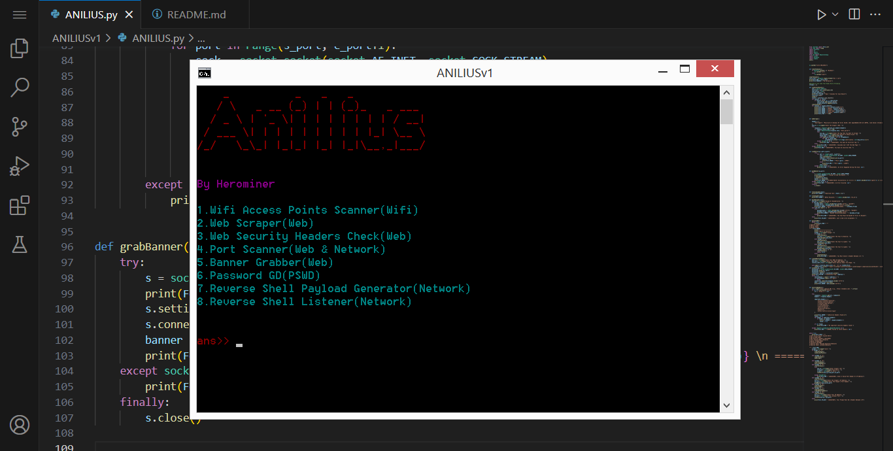

Required Libraries:
1.colorama
2.time 
3.platform 
4.pywifi
5.requests
6.bs4
7.pyfiglet
8.codecs

Description:
This is ANILIUS's first version which is created for helping red teams and pentesters and .....
It has 8 items to use:

1.Wifi Access Points Scanner(scans any access point in your area)
2.Web Scraper(extracts your ideal data from a web page)
3.Web Security Headers Checker(checks the security headers of a web)
4.Port Scanner(scans open ports(it's slow better to use nmap instead))
5.Banner Grabber(to get information for the system that your target's web is using)
6.Password Generator & Decryptor(supports Reverse Cipher,ROT13,Base64)
7.Reverse Shell Payload Generator(creates reverseshell payload(file))
8.Listener(usually used for reverse shells)

====================
IMPORTANT: Don't Use This Tool For Illegal Jobs(optional)
====================

Wrote By Herominer8

